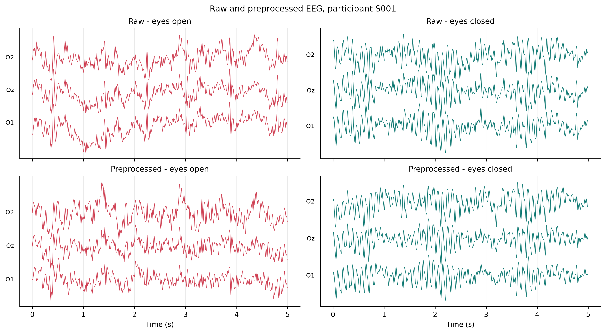
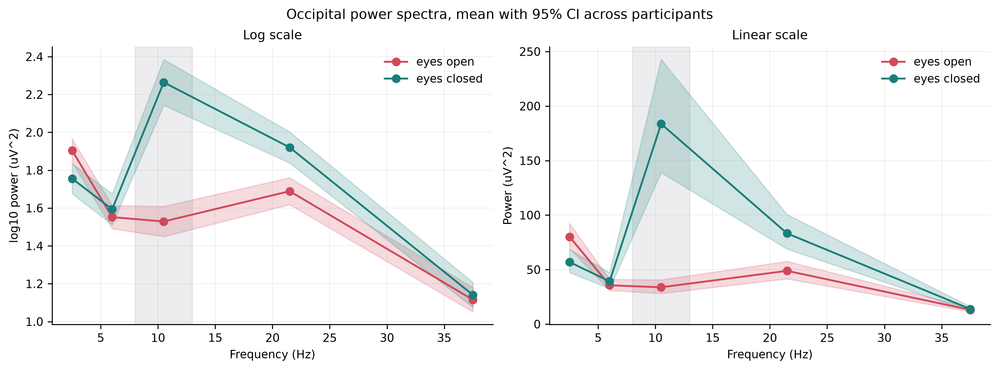
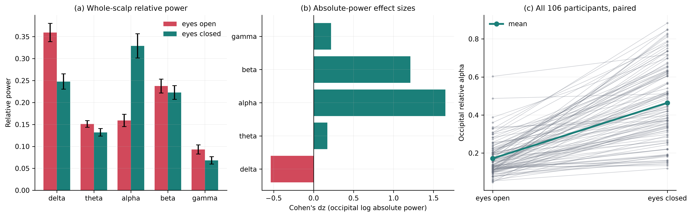
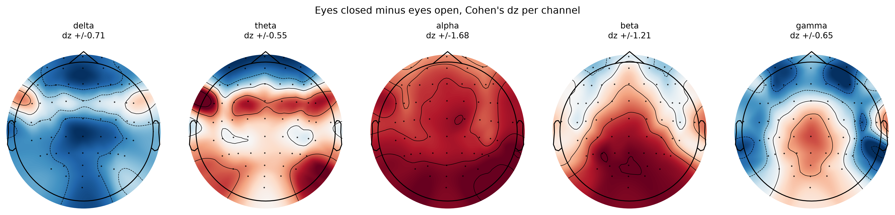
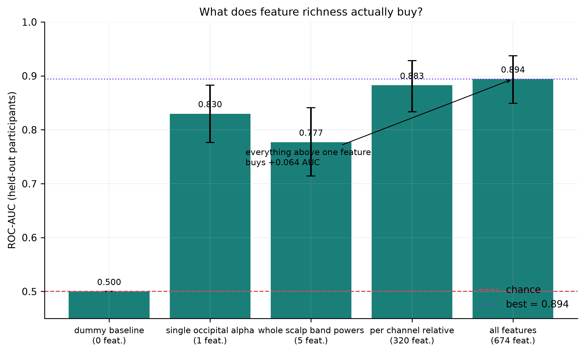
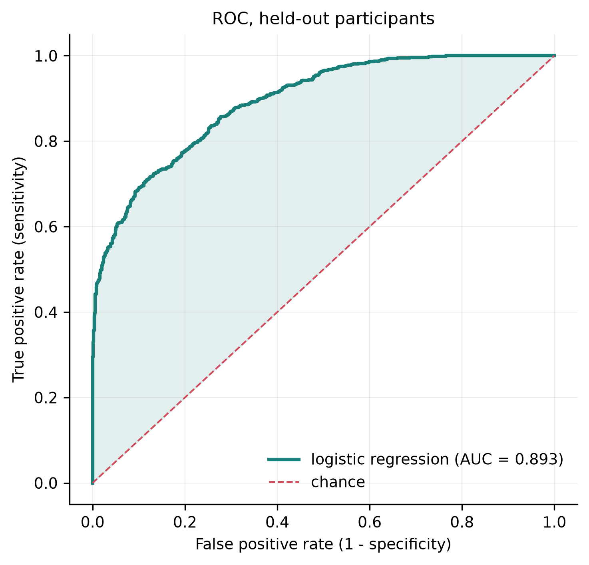
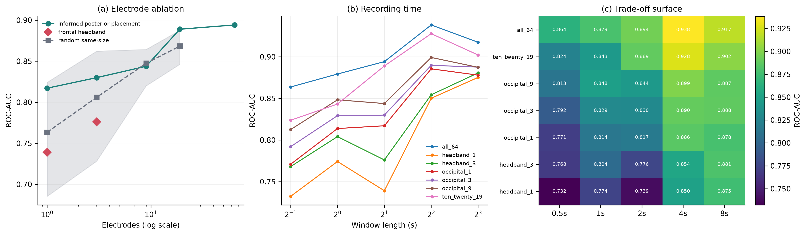
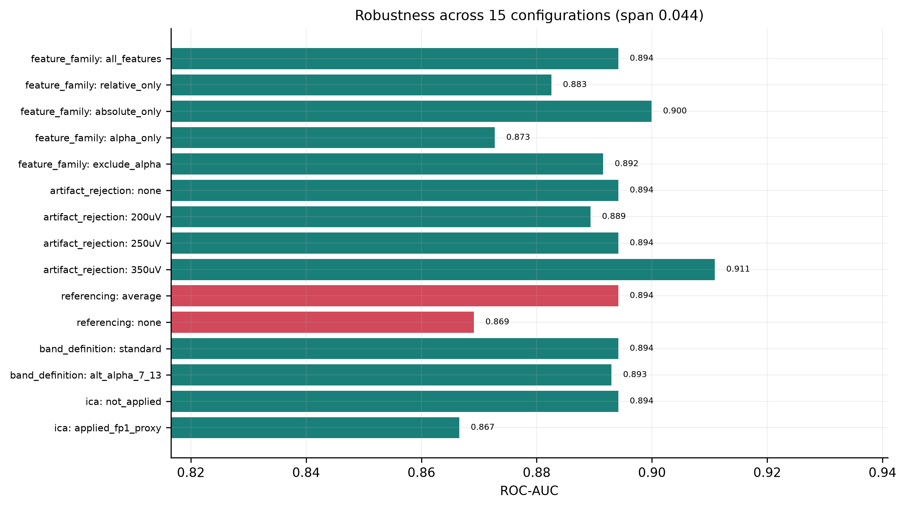
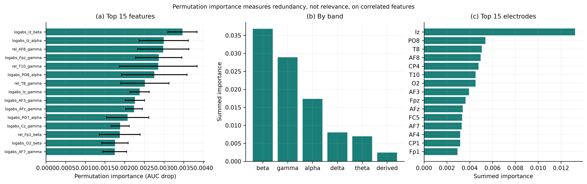
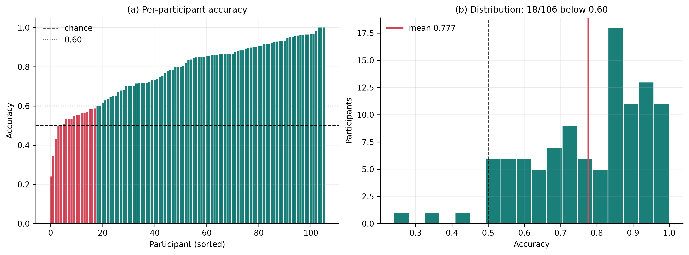

# Diminishing Returns of Electrode Count, Epoch Duration, and Model Complexity in EEG Brain-State Classification

Allan Xia (student)1*

*1. Independent researcher, Prospect, Kentucky, USA; allanxia10@gmail.com*

---

**ABSTRACT.** Resting-state electroencephalography (EEG) reliably distinguishes eyes-open from eyes-closed states, a phenomenon documented since Berger described the alpha rhythm in 1929;1 reports of high classification accuracy for this contrast are therefore of limited value, and the more consequential question is how few resources such classification actually requires. I quantified the marginal contribution of electrode count, epoch duration, and model complexity using the 61-second eyes-open and eyes-closed baseline recordings of 109 adults (64 channels, 160 Hz) from the PhysioNet EEG Motor Movement/Imagery Dataset, of whom 106 provided usable data in both conditions. Recordings were band-pass filtered (1–45 Hz), average-referenced, segmented into 2-second epochs, and reduced to 674 spectral features; all partitions were made over participants rather than epochs, and confidence intervals were obtained by a cluster bootstrap resampling participants. The physiological effect was unambiguous: occipital relative alpha power increased with eye closure in 106 of 106 participants (mean difference +0.282, 95% CI [+0.248, +0.317]; *d*z = +1.59). Classification performance, however, saturated early. A single occipital alpha feature achieved an area under the receiver operating characteristic curve (AUC) of 0.829, whereas 674 features with a tuned classifier achieved only 0.894, and nonlinear learners conferred no advantage (random forest 0.868, gradient boosting 0.892, logistic regression 0.894). Reducing the montage from 64 to 19 electrodes cost 0.004 AUC, and a single occipital electrode retained 0.818. Electrode placement was worth +0.084 AUC at a one-electrode budget relative to random placement but was negligible at nine. Electrode count and epoch duration proved directly interchangeable: one occipital electrode with an 8-second epoch (0.856) matched 64 electrodes with a 0.5-second epoch (0.857). Across 15 preprocessing variants AUC spanned 0.850–0.898. Performance in this paradigm is therefore constrained by physiology and recording duration rather than by feature engineering or model capacity.

**KEYWORDS.** Computer Science; Machine Learning; Electroencephalography; Alpha Rhythm; Data Leakage.

---

> **Note on numbers.** Every figure in this manuscript comes from a pipeline run.

> Regenerate them with `python src/report.py`, which writes `paper/generated_results.md`

> directly from `results/*.csv`. If a number here is not in that file, it did not come

> from the pipeline.

## Introduction

Electroencephalography (EEG) records the summed postsynaptic potentials of large, spatially aligned cortical neuron populations at the scalp. It has millisecond temporal resolution, poor spatial resolution, and — importantly for applications — an equipment cost that ranges across four orders of magnitude, from research systems with 64 or 256 gel electrodes to consumer headbands with a single dry frontal contact. EEG activity is conventionally divided into frequency bands: delta (1–4 Hz), theta (4–8 Hz), alpha (8–13 Hz), beta (13–30 Hz), and gamma (>30 Hz). Band power in these ranges is the standard descriptive vocabulary for resting-state EEG and the standard feature basis for classification.

Berger's 1929 report of the human alpha rhythm already described its central phenomenon: a roughly 10 Hz posterior oscillation that is prominent with the eyes closed and attenuates on eye opening.1 The effect has been quantified repeatedly since, most systematically by Barry et al., who documented the topography and band specificity of the eyes-open/eyes-closed difference in adults,2 and by Barry and De Blasio, who showed that it persists in healthy ageing.3 Mechanistically, the modern account is not that alpha reflects cortical idling but that it reflects active inhibition. The gating-by-inhibition framework4 and the inhibition-timing account5 both treat alpha as pulsed suppression of task-irrelevant input; Pfurtscheller and Lopes da Silva describe the desynchronization that follows sensory input,6 and Hughes and Crunelli locate the generator in thalamocortical loops.7 Given this, a study whose contribution is a high eyes-open/eyes-closed classification accuracy contributes essentially nothing. The separability is not in doubt.

What is genuinely undetermined, and practically consequential, is the *cost* at which the separation can be achieved. A designer choosing hardware faces concrete questions with non-obvious answers. How many electrodes are needed, and does it matter where they go? How long must each recording window be, and can extra time substitute for missing electrodes? Does a machine-learning pipeline over hundreds of features earn its complexity relative to thresholding a single band-power value?

The last question matters beyond this contrast. EEG classification papers routinely report elaborate pipelines without a simple-feature baseline, so it is often impossible to tell how much of the reported performance is attributable to the method rather than to the physiology. Lotte et al. note that simple linear classifiers remain competitive on EEG,8 and Jayaram and Barachant argue that results are frequently not comparable across studies.9 A study that measures the marginal value of complexity directly is more informative than one more accuracy figure.

**Primary question.** How far can electrode count, recording window length, and model complexity be reduced before eyes-open / eyes-closed classification degrades meaningfully, and what is the marginal value of machine-learning complexity over a single physiologically motivated feature? Three hypotheses follow. **H1:** a single occipital relative-alpha feature will come within a small margin of a full multivariate model, because the underlying effect is large and low-dimensional. **H2:** performance will saturate at a small number of electrodes, with placement mattering more than count at small budgets. **H3:** window length will trade off against electrode count, since both increase the effective evidence per decision. A subordinate confirmatory question is whether the classical alpha effect replicates in this dataset at all; if it does not, the cost analysis would be meaningless.

## Methods

### Dataset

I used the PhysioNet EEG Motor Movement/Imagery Dataset (eegmmidb) v1.0.0,10,11 recorded with the BCI2000 system.12 The dataset contains 109 participants recorded at 64 channels (10-10 extended system) and 160 Hz under the Open Data Commons Attribution License v1.0. Only the two baseline runs were used: R01 (eyes open) and R02 (eyes closed), each 61 s long, so that run identity supplies the condition label. Each participant therefore contributed one eyes-open and one eyes-closed baseline, giving a fully paired within-participant design. This dataset was chosen over alternatives because 109 participants is large enough for participant-level cross-validation to be meaningful, because the two baseline runs give a clean binary contrast without task confounds, and because its permissive license allows redistribution and independent verification.

**Provenance and integrity.** The analysis machine could not reach physionet.org. Because the dataset is licensed ODC-BY, which permits redistribution with attribution, the files were obtained from a public mirror instead. To confirm that the mirrored files were the originals rather than modified copies, every retrieved file was hashed and compared against the official PhysioNet SHA-256 manifest: 101 of 101 files for which a reference hash was retrievable matched exactly, with zero mismatches. The complete pipeline, together with the numerical results, figures, and provenance record underlying every value reported here, is archived under a permanent identifier.13

### Preprocessing

Preprocessing was implemented with MNE-Python,14 following artifact-handling conventions established in EEGLAB.15 Each decision and its rationale is given below.

1. **Channel-name standardization and montage.** Raw EDF labels are dot-padded (Fc5., C5..); these were mapped to 10-10 names16 and the standard_1005 montage attached. This is required for interpolation and topographic plotting and does not alter the signal.

2. **Band-pass 1–45 Hz**, zero-phase FIR. The 1 Hz high-pass removes drift and sweat artifact. The 45 Hz low-pass sits below the 60 Hz US mains frequency, so no notch filter is required. Both edges were fixed *a priori* and applied identically to both conditions, so the filter cannot manufacture a group difference. *Possible bias:* the 1 Hz high-pass attenuates the lower delta range, so delta estimates here are conservative.

3. **Bad-channel detection and interpolation.** A channel was marked bad if flat, if its log-variance was an extreme robust-*z* outlier (*z* > 6), or if its maximum absolute correlation with every other channel fell below 0.30.17 The correlation criterion is essential: a first attempt using a plain variance-outlier rule flagged all six frontal electrodes on the first participant, because frontal channels legitimately carry high variance from ocular activity rather than being broken. The final rule flagged 61 channels across 212 recordings (0.29 per recording). Detection used within-recording statistics only and never saw the condition label.

4. **Average reference**, applied after interpolation so that a bad channel is not smeared across the montage. These recordings have no usable physical reference. *Possible bias:* an average reference subtracts the mean across electrodes and therefore attenuates spatially broad activity. This is the one preprocessing choice that materially affected results.

5. **Fixed-length non-overlapping 2-second epochs.** Non-overlapping windows keep samples closer to independent; overlapping windows would inflate the apparent sample size.

6. **Epoch rejection.** An epoch was discarded if more than 20% of channels exceeded a 250 µV peak-to-peak swing. The conventional maximum-peak-to-peak-across-all-channels rule is inappropriate for a 64-channel montage: the maximum is dominated by the single noisiest electrode, and at the usual 150 µV threshold it discarded 97% of epochs in this dataset. The fraction-based rule targets global artifacts (movement, muscle bursts) instead. The threshold pair was fixed before any classification was run, using only the pooled amplitude distribution and one explicit constraint — that rejection rates be balanced across conditions, since differential data loss would itself be a confound. At these values 80.9% of epochs survived in each condition in the calibration sample.

Independent component analysis (ICA) was deliberately not applied by default. These are 61-second recordings with no EOG or ECG channels, so ocular components would have to be identified heuristically rather than by correlation with a reference signal, and misidentification would remove genuine frontal activity.18 ICA was instead evaluated as a robustness condition.

**Quality control.** 106 of 109 participants were usable. Three (S009, S022, S060) lost an entire condition to artifact rejection and were excluded, since a paired design requires both. Retained participants contributed on average 25.8 eyes-open and 27.9 eyes-closed epochs, giving 5,698 epochs (2,739 eyes open, 2,959 eyes closed).

**Figure 1.** Raw versus preprocessed EEG for one participant in both conditions.

### Feature extraction

Power spectral density was estimated per epoch by Welch's method19 using 1-second Hann segments with 0.8-second overlap (six averaged segments per 2-second epoch, 1 Hz resolution). Band edges followed the conventional definitions endorsed by the IFCN EEG research workgroup.20 Each epoch yielded 674 features, summarized in Table 1.

Individual alpha peak frequency was retained as a derived feature because alpha frequency varies systematically between individuals.21 Nothing is fitted across epochs, so feature extraction cannot leak information between participants. Standardization was deferred to the modeling stage and fitted inside each cross-validation fold.

### Prevention of data leakage

Each participant contributes roughly 54 epochs that share their skull thickness, electrode placement, alpha peak frequency, and overall amplitude. A model given epochs from the same person in both training and test data can identify the *person* and recall their condition rather than learning anything about brain state; Saeb et al. quantify the resulting inflation,22 and Kaufman et al. give the general formulation, including leakage introduced by preprocessing fitted outside the validation fold.23 Accordingly:

1. The held-out set was formed by GroupShuffleSplit over participants (30%), yielding 74 training and 32 held-out participants, and was untouched until final evaluation.

2. Hyperparameter searches used GroupKFold over training participants only.

3. All scaling was fitted inside folds via scikit-learn Pipeline objects.24

4. Leave-one-subject-out (LOSO) cross-validation over all 106 participants provides a second, more demanding generalization estimate.

5. An assertion in the training code verifies that no participant appears on both sides of the split.

### Statistical analysis

The unit of analysis is the participant, not the epoch. Averaging each participant's epochs before testing avoids pseudoreplication; testing at the epoch level would inflate the effective sample size roughly fiftyfold. Because every participant provides both conditions, comparisons are paired: paired *t*-tests with Wilcoxon signed-rank as a distribution-free check, Cohen's *d*z with 95% confidence intervals on the mean paired difference, and Benjamini–Hochberg false discovery rate control at *q* < 0.05 across the 320 channel × band comparisons.25

Relative band power is compositional — the five bands sum to one, so a genuine rise in one band mechanically depresses every other. I therefore repeated the tests on log absolute power to distinguish real changes from renormalization artifacts.

### Models and the complexity sweep

Model comparison used a dummy classifier (most-frequent), logistic regression, linear support vector machine (SVM), random forest, and histogram gradient boosting, tuned by grid search where a grid applied. The complexity sweep held the learner fixed at logistic regression with the selected *C* = 0.01 and varied only the data, because re-tuning per configuration would confound "this configuration carries more information" with "this configuration got a luckier search". Electrode budgets were compared against random same-size electrode subsets (10 draws each), so that an informed placement can be judged against an arbitrary one.

Confidence intervals use a cluster bootstrap resampling participants with replacement (2,000 draws for headline models). An ordinary bootstrap over epochs would treat ~54 dependent observations as independent and report intervals several times too narrow.26

## Results

### Replication of the classical alpha effect

Occipital (O1/Oz/O2) relative alpha power was higher with eyes closed in 106 of 106 participants — every single one. The mean paired difference was +0.282 (95% CI [+0.248, +0.317]), *d*z = +1.59, *t*(105) = 16.34, *p* = 1.3 × 10−30. Of the 320 channel × band comparisons, 253 survived FDR correction.

Separating genuine change from compositional renormalization was informative (Table 2, Figure 3). Two findings would have been missed by reporting relative power alone. Theta's apparent decrease is entirely a renormalization artifact. Beta's apparent absence of change conceals a substantial genuine increase in absolute power (*d*z = +1.22). The largest single-channel effects were at posterior sites: O2 delta (*d*z = −1.63), O1 delta (−1.61), O2 alpha (+1.60), PO8 alpha (+1.59).

**Figure 2.** Occipital power spectra, mean with 95% CI across participants.

**Figure 3.** (a) Whole-scalp relative power. (b) Occipital absolute-power effect sizes. (c) Every participant, paired.

**Figure 4.** Scalp topography of the eyes-closed minus eyes-open difference.

### Feature richness and model complexity

The entire return on going from one feature to 674 is +0.065 AUC and +5.3 accuracy points (Table 3), and the confidence intervals overlap heavily. Under LOSO across all 106 participants the gap narrows further, to +0.035 AUC (0.876 vs 0.841) and +2.2 accuracy points (0.778 ± 0.155 vs 0.756 ± 0.150). H1 is supported.

A non-obvious result: five whole-scalp band powers (AUC 0.779) perform worse than one occipital channel (0.829). Averaging band power across the scalp destroys the spatial localization that makes alpha diagnostic — a spatially specific effect is diluted by 64 channels, most of which carry little signal.

Nonlinear learners did not help; the best model was the simplest one tested (Table 4). The confusion matrix for logistic regression shows 749 / 122 / 230 / 695 (TN/FP/FN/TP), that is, specificity 0.860 exceeding sensitivity 0.751 — the model is more reliable when it declares "eyes open".

**Figure 5.** What feature richness buys.

**Figure 6.** ROC curve for logistic regression on held-out participants.

### Quantifying leakage from epoch-level splitting

To quantify what participant-level splitting protects against, I repeated the headline analysis with an ordinary random split over epochs, so that the same participant could appear in both training and test data. Everything else was identical. Accuracy rose from 0.804 to 0.856 and AUC from 0.894 to 0.940.

The inflation produced by this single methodological error (+0.046 AUC) is of the same order as the entire benefit of adding 673 features and a tuned model (+0.065 AUC). A study that splits epochs at random and reports a large gain from an elaborate pipeline may be reporting mostly leakage. This is the strongest practical argument for the design used here.

### Electrode count and placement

Dropping 45 of 64 electrodes cost 0.004 AUC (Table 5). Dropping to a single occipital electrode cost 0.076 — it retained 81% of the above-chance AUC of the full montage.

The comparison against random subsets is the informative part. At one electrode, informed occipital placement beat random placement by +0.084 AUC (0.818 vs 0.734); at three, by +0.032. At nine and nineteen the advantage vanished entirely (0.837 vs 0.841; 0.890 vs 0.877). Placement is worth a great deal when electrodes are scarce and essentially nothing once about nine are spread over the scalp. H2 is supported.

A frontal headband electrode (Fpz, AUC 0.740) performed no better than a randomly chosen electrode (0.734) and 0.078 below Oz — the placement consumer hardware adopts for mechanical convenience is close to the worst choice for this particular contrast.

### Recording time as a substitute for electrodes

AUC rose monotonically with window length and had not saturated at 8 seconds (Table 6). Crossing the two axes gives a clean trade-off surface (Table 7, Figure 6c).

One occipital electrode with an 8-second window (0.856) matches 64 electrodes with a 0.5-second window (0.857). Sixty-three electrodes and 7.5 seconds of latency are, for this task, interchangeable. H3 is supported. Note that the 8-second condition retained only 99 participants, because a 61-second run yields just seven 8-second epochs and rejection can eliminate a condition entirely.

**Figure 7.** Primary result: ablation, window curves, and the trade-off surface.

### Robustness to preprocessing choices

Across 15 configurations AUC spanned 0.850–0.898 (Table 8, Figure 9). Three points deserve emphasis. First, the artifact-rejection threshold is essentially irrelevant, and performance with no rejection at all (0.897) is marginally the highest — so the differential rejection between conditions is not driving any result. Second, ICA changes nothing, retrospectively justifying its omission. Third, the only choice that matters is re-referencing: removing the average reference costs 0.044 AUC.

Most striking is the feature-family row. Removing every alpha feature costs only 0.004 AUC (0.894 → 0.890), while alpha features alone reach 0.872. The information is heavily redundant across bands, because eye closure changes the whole spectrum, not alpha in isolation.

**Figure 8.** Robustness across 15 preprocessing configurations.

### Feature importance and its limitations

Summed permutation importance on the held-out set ranked bands: beta (+0.0370) > gamma (+0.0259) > alpha (+0.0232) > delta (+0.0071) > theta (+0.0049). Top individual features were logabs_Iz_beta, logabs_Iz_alpha, logabs_AF7_gamma, and rel_AF8_gamma; Iz (inion) is the most posterior electrode in the montage.

This ranking directly contradicts the univariate statistics, and the contradiction is instructive rather than a result. In the paired tests alpha is by far the largest effect (*d*z = +1.64) while beta is smaller (+1.22). Permutation importance behaves badly with correlated features: alpha information is duplicated across dozens of posterior electrodes, so permuting any single alpha feature barely degrades the model, which finds the same information elsewhere. Beta is somewhat less redundant and so appears more important. The ablation above resolves the question properly — removing all alpha features costs almost nothing precisely because the information is redundant, not because alpha is unimportant. Permutation importance on correlated feature sets measures redundancy, not relevance, and should not be read as a claim about which rhythm carries the signal.

**Figure 9.** Permutation importance by feature, band, and electrode.

### Between-participant variability

Median per-participant accuracy on the held-out set was 0.831 (min 0.500, max 1.000), with 4 of 32 participants below 0.60. Under LOSO across all 106, mean accuracy was 0.778 ± 0.155, with 17 of 106 participants below 0.60 and a minimum of 0.320 — worse than chance. The aggregate figure conceals a long tail. Since occipital alpha increased in all 106 participants, the failures reflect *magnitude*, not direction: individuals with weak alpha modulation are not well served by a group-trained model. Reporting only mean accuracy would hide this entirely.

**Figure 10.** Per-participant and leave-one-subject-out performance.

## Discussion

### Principal findings

The physiological effect is enormous and universal in this sample: occipital alpha power rises roughly fivefold on eye closure, in every one of 106 participants. The classification problem it defines is correspondingly easy, and this is exactly why classification accuracy is a poor headline. Performance saturates almost immediately. One electrode and one feature deliver AUC 0.818–0.829; sixty-four electrodes, 674 features, and a tuned model deliver 0.894. The marginal return on nearly all of the apparatus is a few points.

The useful levers are elsewhere. Electrode *placement* is worth +0.084 AUC at a one-electrode budget and nothing at nine. Recording *time* buys a steady and unsaturated improvement, and substitutes directly for electrodes at roughly the exchange rate of 63 electrodes for 7.5 seconds. Model *family* buys nothing at all — the simplest classifier tested was the best.

### Neuroscientific interpretation

**What the data demonstrate.** Occipital alpha rises ~5.1× on eye closure and occipital beta ~1.7×, while delta falls; effects are largest at posterior electrodes, and the classification information is heavily redundant across bands and electrodes.

**A plausible biological explanation.** The posterior topography is consistent with generation in occipital and parieto-occipital cortex under thalamocortical control,7 where rhythmic bursting in thalamic relay and reticular nuclei entrains cortical populations. On the gating-by-inhibition account,4,5 eye closure removes patterned visual input, and high-amplitude alpha reflects active pulsed suppression of visual cortex rather than passive idling. Eye opening restores input, and the resulting desynchronization6 both reduces alpha amplitude and broadens the spectrum. That posterior electrodes show the strongest differences follows from proximity to these generators and from the fact that scalp EEG is dominated by the nearest synchronous cortical sources. The beta increase is more ambiguous. It may partly reflect harmonics of a large ~10 Hz oscillation appearing near 20 Hz, and partly genuine beta-band change; these data cannot separate the two, and I make no such claim.

**What I explicitly do not claim.** Nothing here establishes causation. That a feature is useful to a classifier does not mean it generates the difference, and feature-importance rankings on correlated EEG features can invert the true effect sizes. Nor is the eyes-open/eyes-closed contrast purely visual: the conditions differ in arousal as well as sensory input,2 and this design cannot disentangle them.

### Comparison with previous work

The direction, topography, and approximate magnitude of the alpha effect match Barry et al.2 and Barry and De Blasio,3 which supports the validity of the pipeline. The observation that a simple linear model matches or beats nonlinear alternatives is consistent with Lotte et al., who report that linear classifiers remain competitive on EEG.8 The finding that performance saturates at a handful of electrodes is encouraging for the low-channel systems reviewed by Casson27 and benchmarked against research-grade hardware by Ratti et al.,28 with the important qualification that placement, not merely channel count, determines whether a low-channel system works — a frontal headband electrode performed no better than a randomly placed one here.

### Limitations

1. **Condition is confounded with run.** Eyes-open and eyes-closed were recorded as separate consecutive runs, so any slow drift in impedance, alertness, or electrode contact between runs is perfectly confounded with condition. This is inherent to the paradigm and cannot be resolved within this dataset; an interleaved-block design would be required.

2. **Differential epoch rejection.** Eyes-open epochs were rejected more often than eyes-closed (13.7% vs 6.9%, Wilcoxon *p* = 1.3 × 10−4), consistent with blinks. The robustness analysis shows results are unchanged with no rejection at all (AUC 0.897), so this does not drive the findings, but it remains an asymmetry in the data.

3. **Short recordings.** 61 seconds per condition limits the number of long windows; the 8-second condition lost 7 participants for this reason, and the window-length curve had not saturated where the data ran out.

4. **Homogeneous sample.** Participants are healthy volunteers of unreported demographics recorded on one system in one laboratory. Generalization to clinical populations, other hardware, or dry electrodes is untested.

5. **One dataset, one contrast.** The cost curves reported here are specific to a large, spatially focal, low-dimensional effect. A subtler or more distributed contrast — mental workload, attention state, early pathology — would very plausibly show a different shape, and complexity might well earn its keep there. This is the single most important caveat: my conclusion is that complexity is unnecessary *for this problem*, not that it is unnecessary in general.

6. **Simulated rather than measured deployment.** Electrode subsets were formed by discarding channels from a 64-channel average-referenced recording. A true one-electrode system would have a different reference, different noise, and no neighbors to interpolate from, and would likely perform somewhat worse than the estimate reported here.

7. **Limited hyperparameter search.** The analysis ran on a single CPU core, so tree-model grids were small. Given that the two nonlinear models both underperformed logistic regression, I do not think a larger search would overturn the conclusion, but I cannot exclude it.

## Conclusions and future work

Electrode count, window length, and model complexity can all be reduced very far before eyes-open / eyes-closed classification degrades meaningfully, and the complexity is worth very little. A single occipital electrode with a single alpha feature achieves ROC-AUC 0.818–0.829 on participants never seen in training. Adding 63 electrodes, 673 features, and a tuned classifier raises this to 0.894 — an improvement of about 0.07 AUC for roughly two orders of magnitude more hardware and computation. Nonlinear models do not help. Electrode placement is worth +0.084 AUC at a one-electrode budget and nothing at nine, and recording time substitutes directly for electrodes.

Alpha shows by far the largest univariate effect, yet information is so redundant that removing every alpha feature costs only 0.004 AUC: alpha is sufficient but not necessary for classification, because eye closure reshapes the entire spectrum. Posterior sites dominate, and a frontal headband electrode performs no better than a random one. Generalization to unseen participants is good on average but the mean hides a long tail, with 17 of 106 participants below 0.60.

One methodological result is worth as much as the main finding. Splitting epochs at random instead of by participant inflates AUC from 0.894 to 0.940 — an error that yields more apparent improvement than the entire machine-learning apparatus does honestly.

For anyone building a low-cost system for this class of contrast, the practical guidance is to spend the budget on electrode placement and on window length, not on channel count or model sophistication; to validate on held-out participants; and to report the per-participant distribution rather than the mean. Future work should test whether the saturation shape holds for harder contrasts where the effect is smaller and more distributed; whether personalized or few-shot calibration rescues the long tail of poorly classified participants; whether these curves survive on genuinely low-channel dry-electrode hardware rather than simulated subsets; and whether the beta increase reported here is harmonic or physiologically independent.

This study confirms a finding from 1929, and the confirmation is not the contribution. The contribution is the measurement of what the modern apparatus adds to Berger's observation, and the answer — a few points of AUC — is one that studies reporting only a final accuracy figure would never surface.

## Acknowledgements

The author thanks the BCI2000 group for developing and sharing the acquisition system and the original recordings, and PhysioNet for maintaining open access to the dataset. This work depends entirely on their willingness to make primary data freely available.

## Declarations

**Data availability:** This study is a secondary analysis of a publicly available dataset. All recordings analyzed here are from the EEG Motor Movement/Imagery Database (eegmmidb) v1.0.0, archived at PhysioNet under the Open Data Commons Attribution License v1.0 (reference 10). The specific recordings used are the two baseline runs of each participant, R01 and R02, totaling 218 files. No new data were generated for this study.

**Code availability:** All analysis code is archived at https://doi.org/10.5281/zenodo.22243161 and developed at https://github.com/allanxia10-lhmt/EEG-Brain-State-Classification; the version used for this manuscript is tagged v1.0.0. The complete pipeline, from data retrieval through figure generation, reproduces with a single command, and random seeds are fixed at 42 throughout. The archive also contains the numerical results files, the published figures, and the checksum-verification record underlying every value reported here, so the tables and figures can be checked without re-running the analysis. The test suite contains 41 tests, including explicit assertions that no participant appears in both training and test partitions and a negative control in which labels permuted within participant must yield an AUC of approximately 0.5.

**Software and tools:** Analyses were performed in Python with MNE-Python,14 scikit-learn,24 NumPy, SciPy, pandas, and Matplotlib. All figures were generated by the author's own analysis code from the numerical results; none is AI-generated.

**Generative AI use:** [Author to complete before submission: IJHSR requires disclosure and citation of any generative AI use, with tool name, version, URL, and a retained prompt log.]

**Ethics approval:** No human participants were recruited and no new recordings were made for this study. The analysis uses fully de-identified data collected previously by the BCI2000 group and placed in the public domain by PhysioNet under an open license. Institutional review board approval was therefore not required for this secondary analysis.

**Funding:** This is an independent research project. It received no grant from any funding agency in the public, commercial, or not-for-profit sectors, and was not conducted under institutional supervision.

**Competing interests:** The author declares no competing interests.

## References

1. Berger, H. Über das Elektrenkephalogramm des Menschen. Arch. Psychiatr. Nervenkr. 1929, 87 (1), 527–570. https://doi.org/10.1007/BF01797193.

2. Barry, R. J.; Clarke, A. R.; Johnstone, S. J.; Magee, C. A.; Rushby, J. A. EEG Differences between Eyes-Closed and Eyes-Open Resting Conditions. Clin. Neurophysiol. 2007, 118 (12), 2765–2773. https://doi.org/10.1016/j.clinph.2007.07.028.

3. Barry, R. J.; De Blasio, F. M. EEG Differences between Eyes-Closed and Eyes-Open Resting Remain in Healthy Ageing. Biol. Psychol. 2017, 129, 293–304. https://doi.org/10.1016/j.biopsycho.2017.09.010.

4. Jensen, O.; Mazaheri, A. Shaping Functional Architecture by Oscillatory Alpha Activity: Gating by Inhibition. Front. Hum. Neurosci. 2010, 4, 186. https://doi.org/10.3389/fnhum.2010.00186.

5. Klimesch, W. Alpha-Band Oscillations, Attention, and Controlled Access to Stored Information. Trends Cogn. Sci. 2012, 16 (12), 606–617. https://doi.org/10.1016/j.tics.2012.10.007.

6. Pfurtscheller, G.; Lopes da Silva, F. H. Event-Related EEG/MEG Synchronization and Desynchronization: Basic Principles. Clin. Neurophysiol. 1999, 110 (11), 1842–1857. https://doi.org/10.1016/S1388-2457(99)00141-8.

7. Hughes, S. W.; Crunelli, V. Thalamic Mechanisms of EEG Alpha Rhythms and Their Pathological Implications. Neuroscientist 2005, 11 (4), 357–372. https://doi.org/10.1177/1073858405277450.

8. Lotte, F.; Bougrain, L.; Cichocki, A.; Clerc, M.; Congedo, M.; Rakotomamonjy, A.; Yger, F. A Review of Classification Algorithms for EEG-Based Brain–Computer Interfaces: A 10 Year Update. J. Neural Eng. 2018, 15 (3), 031005. https://doi.org/10.1088/1741-2552/aab2f2.

9. Jayaram, V.; Barachant, A. MOABB: Trustworthy Algorithm Benchmarking for BCIs. J. Neural Eng. 2018, 15 (6), 066011. https://doi.org/10.1088/1741-2552/aadea0.

10. Schalk, G.; McFarland, D. J.; Hinterberger, T.; Birbaumer, N.; Wolpaw, J. R. EEG Motor Movement/Imagery Database (eegmmidb), version 1.0.0; PhysioNet, 2009. https://doi.org/10.13026/C28G6P (accessed 2026-08-29).

11. Goldberger, A. L.; Amaral, L. A. N.; Glass, L.; et al. PhysioBank, PhysioToolkit, and PhysioNet: Components of a New Research Resource for Complex Physiologic Signals. Circulation 2000, 101 (23), e215–e220. https://doi.org/10.1161/01.CIR.101.23.e215.

12. Schalk, G.; McFarland, D. J.; Hinterberger, T.; Birbaumer, N.; Wolpaw, J. R. BCI2000: A General-Purpose Brain–Computer Interface (BCI) System. IEEE Trans. Biomed. Eng. 2004, 51 (6), 1034–1043. https://doi.org/10.1109/TBME.2004.827072.

13. Xia, A. Diminishing Returns of Electrode Count, Epoch Duration, and Model Complexity in EEG Brain-State Classification, version 1.0.0; Zenodo, 2026. https://doi.org/10.5281/zenodo.22243161.

14. Gramfort, A.; Luessi, M.; Larson, E.; et al. MEG and EEG Data Analysis with MNE-Python. Front. Neurosci. 2013, 7, 267. https://doi.org/10.3389/fnins.2013.00267.

15. Delorme, A.; Makeig, S. EEGLAB: An Open Source Toolbox for Analysis of Single-Trial EEG Dynamics Including Independent Component Analysis. J. Neurosci. Methods 2004, 134 (1), 9–21. https://doi.org/10.1016/j.jneumeth.2003.10.009.

16. Jasper, H. H. The Ten-Twenty Electrode System of the International Federation. Electroencephalogr. Clin. Neurophysiol. 1958, 10 (2), 371–375.

17. Bigdely-Shamlo, N.; Mullen, T.; Kothe, C.; Su, K.-M.; Robbins, K. A. The PREP Pipeline: Standardized Preprocessing for Large-Scale EEG Analysis. Front. Neuroinform. 2015, 9, 16. https://doi.org/10.3389/fninf.2015.00016.

18. Chaumon, M.; Bishop, D. V. M.; Busch, N. A. A Practical Guide to the Selection of Independent Components of the Electroencephalogram for Artifact Correction. J. Neurosci. Methods 2015, 250, 47–63. https://doi.org/10.1016/j.jneumeth.2015.02.025.

19. Welch, P. D. The Use of Fast Fourier Transform for the Estimation of Power Spectra: A Method Based on Time Averaging over Short, Modified Periodograms. IEEE Trans. Audio Electroacoust. 1967, 15 (2), 70–73. https://doi.org/10.1109/TAU.1967.1161901.

20. Babiloni, C.; Barry, R. J.; Başar, E.; et al. International Federation of Clinical Neurophysiology (IFCN) – EEG Research Workgroup: Recommendations on Frequency and Topographic Analysis of Resting State EEG Rhythms. Part 1. Clin. Neurophysiol. 2020, 131 (1), 285–307. https://doi.org/10.1016/j.clinph.2019.06.234.

21. Klimesch, W. EEG Alpha and Theta Oscillations Reflect Cognitive and Memory Performance: A Review and Analysis. Brain Res. Rev. 1999, 29 (2–3), 169–195. https://doi.org/10.1016/S0165-0173(98)00056-3.

22. Saeb, S.; Lonini, L.; Jayaraman, A.; Mohr, D. C.; Kording, K. P. The Need to Approximate the Use-Case in Clinical Machine Learning. GigaScience 2017, 6 (5), 1–9. https://doi.org/10.1093/gigascience/gix019.

23. Kaufman, S.; Rosset, S.; Perlich, C.; Stitelman, O. Leakage in Data Mining: Formulation, Detection, and Avoidance. ACM Trans. Knowl. Discov. Data 2012, 6 (4), 15. https://doi.org/10.1145/2382577.2382579.

24. Pedregosa, F.; Varoquaux, G.; Gramfort, A.; et al. Scikit-Learn: Machine Learning in Python. J. Mach. Learn. Res. 2011, 12, 2825–2830.

25. Benjamini, Y.; Hochberg, Y. Controlling the False Discovery Rate: A Practical and Powerful Approach to Multiple Testing. J. R. Stat. Soc. Ser. B 1995, 57 (1), 289–300. https://doi.org/10.1111/j.2517-6161.1995.tb02031.x.

26. Varoquaux, G. Cross-Validation Failure: Small Sample Sizes Lead to Large Error Bars. NeuroImage 2018, 180, 68–77. https://doi.org/10.1016/j.neuroimage.2017.06.061.

27. Casson, A. J. Wearable EEG and Beyond. Biomed. Eng. Lett. 2019, 9 (1), 53–71. https://doi.org/10.1007/s13534-018-00093-6.

28. Ratti, E.; Waninger, S.; Berka, C.; Ruffini, G.; Verma, A. Comparison of Medical and Consumer Wireless EEG Systems for Use in Clinical Trials. Front. Hum. Neurosci. 2017, 11, 398. https://doi.org/10.3389/fnhum.2017.00398.

Annotated versions with verification notes are in `references.md`.

